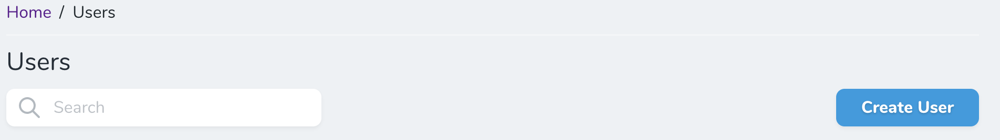
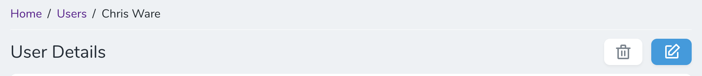
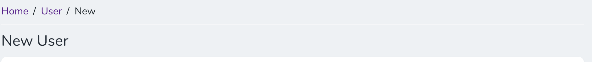
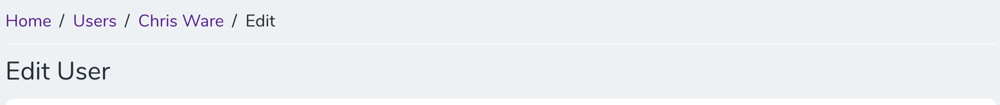
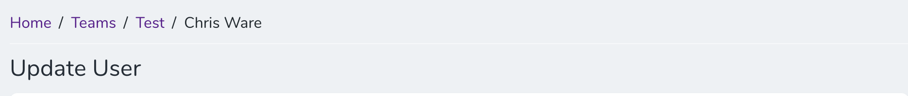

# Nova Breadcrumbs
Breadcrumbs for Laravel Nova

**IMPORTANT**  
This is a work-in-progress package and is liable to change. Advised not to use in production environments unless you know what you are doing and have complete faith in the code working.

 ## Installation

You can install the package in to a Laravel app that uses [Nova](https://nova.laravel.com) via composer:

```bash
composer require morphsites-limited/nova-breadcrumbs
```

Next, you must register the tool with Nova. This is typically done in the `tools` method of the `NovaServiceProvider`.

```php
// in app/Providers/NovaServiceProvder.php

// ...
public function tools()
{
    return [
        // ...
        \Morphsites\NovaBreadcrumbs\NovaBreadcrumbs::make(),
    ];
}
```

Finally, add the Breadcrumbs trait to your App\Nova\Resource class.

```php
use Morphsites\NovaBreadcrumbs\Traits\Breadcrumbs;

abstract class Resource extends NovaResource
{
    use Breadcrumbs;
```

## Customisation

You can disable the bundled styles and load your own by adding the following method to the call:

```php
// in app/Providers/NovaServiceProvder.php

// ...
public function tools()
{
    return [
        // ...
        \Morphsites\NovaBreadcrumbs\NovaBreadcrumbs::make()->withoutStyles(),
    ];
}
```

You can also customise both the label and title for a Resource. Label refers to the Resource's Name, so a Users Resource would have a Users label. Title refers to the title of the Resource as set by the $title property on the resource, so by default it would be the resource ID. Both of these can be overwritten for Breadcrumbs only by overwriting the functions on the trait that start with breadcrumb.

## Information

This package works on the following views:
- Dashboard
- Index
- Detail
- Create
- Update
- Attach
- UpdateAttached

The Detail view makes use of of the custom header components that are currently available in the core Laravel Nova views. There are 2 new custom Vue components that are introduced for extensibility, for this view. They are custom-detail-pre-breadcrumbs and custom-detail-post-breadcrumbs.

The remaining views are hooked via an overwrite to the routes, forcing them to use custom extended views.

This package will work with either numeric IDs or UUIDs, whichever is set up as the ID field for your Models.

## Screenshots
#### Dashboard

#### Index

#### Detail

#### Create

#### Update

#### Attach

#### Update Attached


## Contributing
In order to contribute, a few steps need to be followed in order to compile the code. Suggested that you put Nova's Vue into dev mode.

* copy the webpack.mix.js.dist file to webpack.mix.js inside your nova directory (probably in vendor/laravel)
* run npm install & npm dev (or yarn equivalents) in both your nova directory and the breadcrumbs directory
* You then only need to recompile the breadcrumbs assets via npm run dev (or yarn dev) when building.
* Ensure that, before commiting, npm prod or yarn prod is run.

